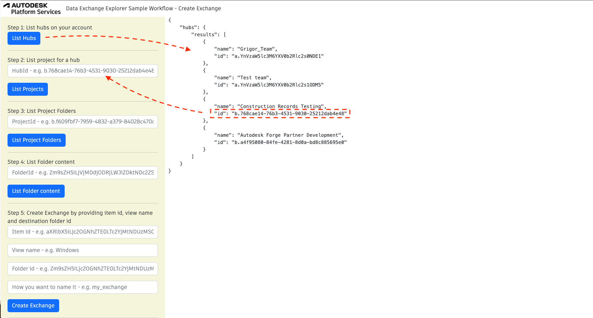
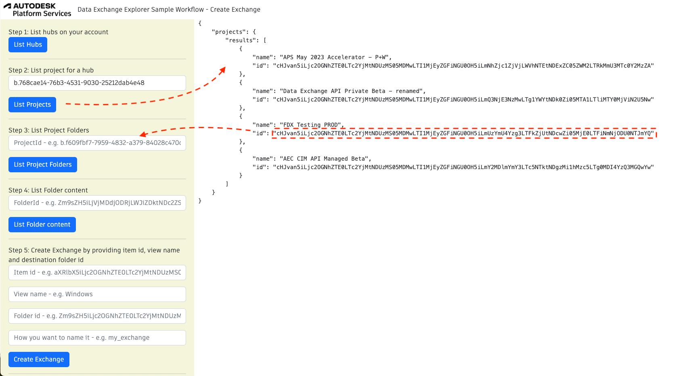
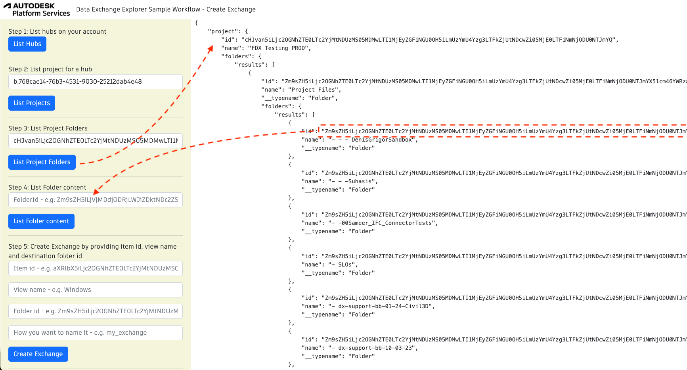
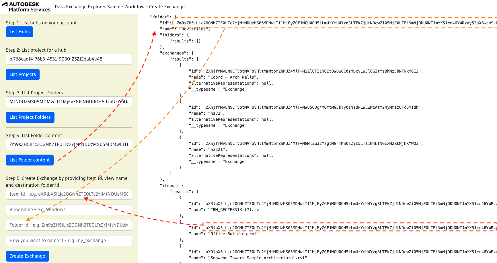
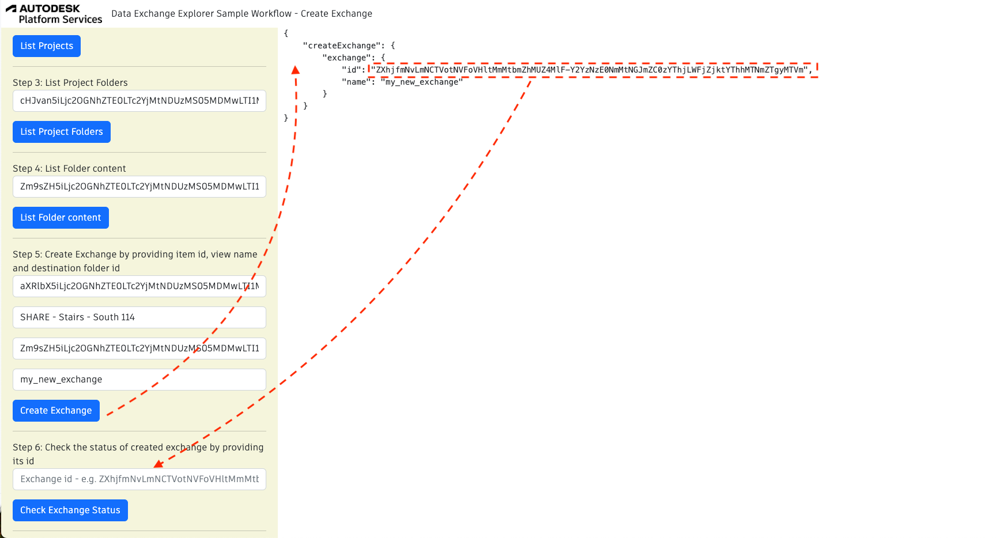
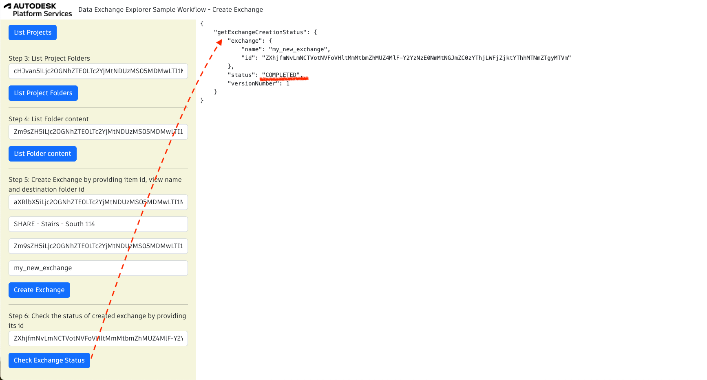

## Exchange Creation Workflow

To create an exchange from Revit file using Data Exchange GraphQL API, you would need:

- **sourceID** - in this workflow we will explore the creation of exchange from a Revit file
- **viewName** - the view from the Revit file, from which you want to create the exchange
- **exchangeName** - the name of the newly created exchange
- **folderID** - the id of the folder where the newly created exchange should be put

To check this workflow, we will start by navigating to the needed source file, getting its id, getting the id of the 
destination folder and trigger exchange creation. 

After the creation of the exchange was triggered, we will check the status of it to see if it is **IN PROGRESS** or it is **COMPLETE**.

To run the sample, please review [setup](./README.md#SETUP) instructions.

## Step 1: List all hubs

After login (top-right), click on `List Hubs` and take note of the hubId (`id`) [See NodeJs code](/services/aps/dx.js).



## Step 2: List all projects

Use the `hubId` from Step 1 and click `List Projects` to list all the projects within a Hub. Take note of the Project ID (`id`) for subsequent steps [See NodeJs code](/services/aps/dx.js).




## Step 3: List Project Folders

Use the `projectId` from Step 2 and click `List Project Folders` to list all the folders in a Project. Take note of the Folder ID (`id`) for subsequent steps [See NodeJs code](/services/aps/dx.js).



## Step 4: List Folder Content

Use the `folderId` from Step 3 and click `List Folder Content` to list a folder and exchanges within a Project. 
Take note of the item ID (`id`) for subsequent steps, as well as the folder ID if you want to have your exchange created in the same folder. [See NodeJs code](/services/aps/dx.js).



***Note:*** For the next step, we are interested only in id of **Revit** files.


## Step 5: Create Exchange

Use the `Item ID` and the `Folder ID` from Step 4, fill the `View Name` and set the `Name` of exchange that will be created.
Click `Create Exchange` to trigger creation of the exchange [See NodeJs code](/services/aps/dx.js).



## Step 6: Check the status of newly created exchange

Use the `exchangeId` of newly created exchange to check if the exchange creation process is completed. 
The status can be either **IN PROGRESS**, **COMPLETE** or **FAILED**[See NodeJs code](/services/aps/dx.js)



Mutation adn Query used:

```
mutation CreateExchangeFromRevit($revit_file_id:String!, $folder_id:String!) {
    createExchange(
        input: {
            viewName: "SHARE - Stairs - South 114"
            source: {
                fileId: $revit_file_id
            }
            target: {
                name: "my_exchange_from_revit"
                folderId: $folder_id
            }
        }
    ) {
        exchange {
            id
            name
    }
  }
}
```


```
query getExchangeStatus ($exchangeId:ID!){
      getExchangeCreationStatus(exchangeId: $exchangeId) {
            exchange{
                name
            }
            status
            versionNumber
            exchange{
                id
                name
            }
      
      }
}
```
***Note:*** We used as a source for an exchange a Revit file, but more formats and sources are on the roadmap
