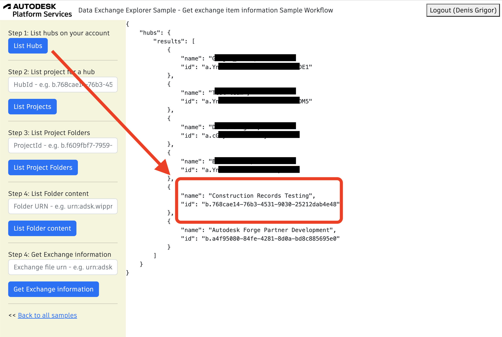
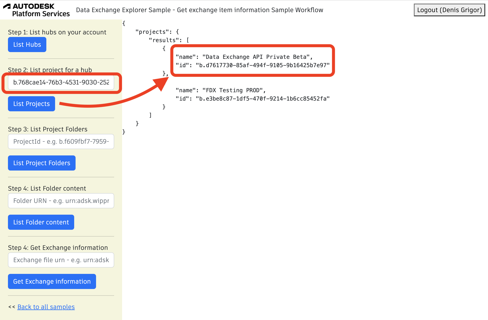
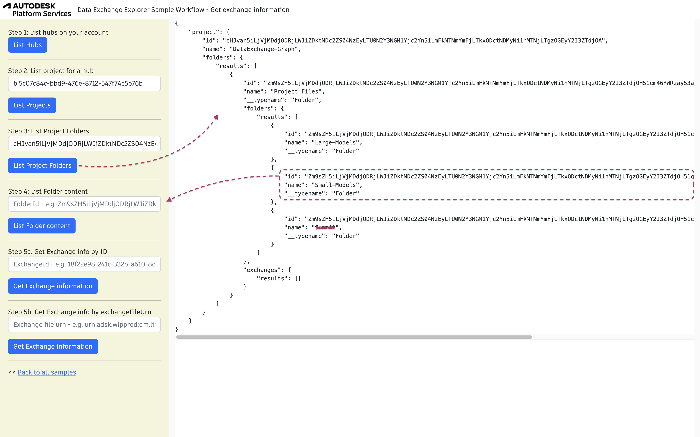
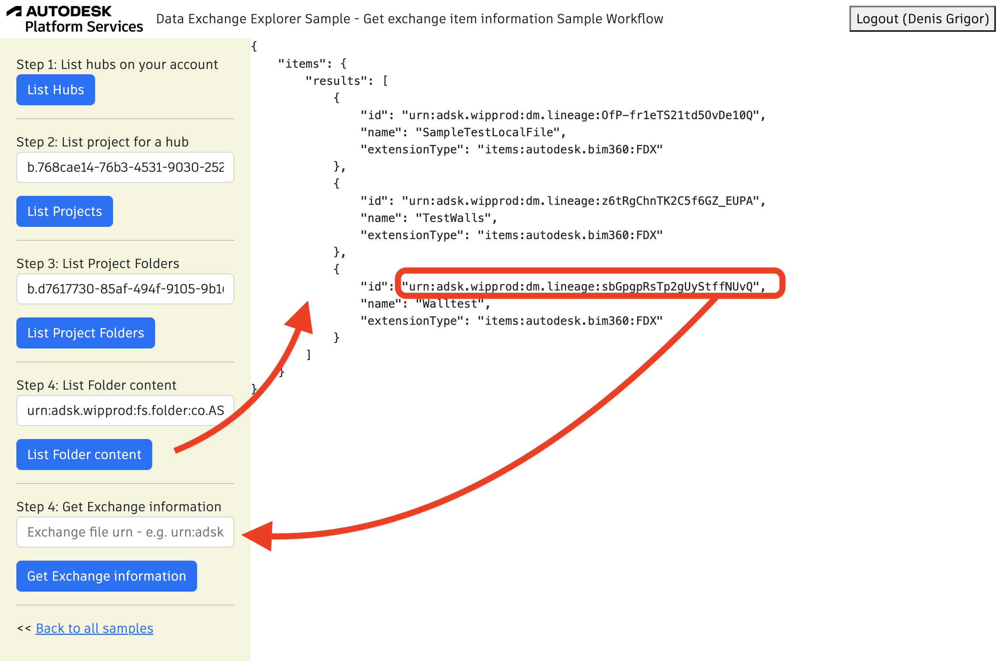
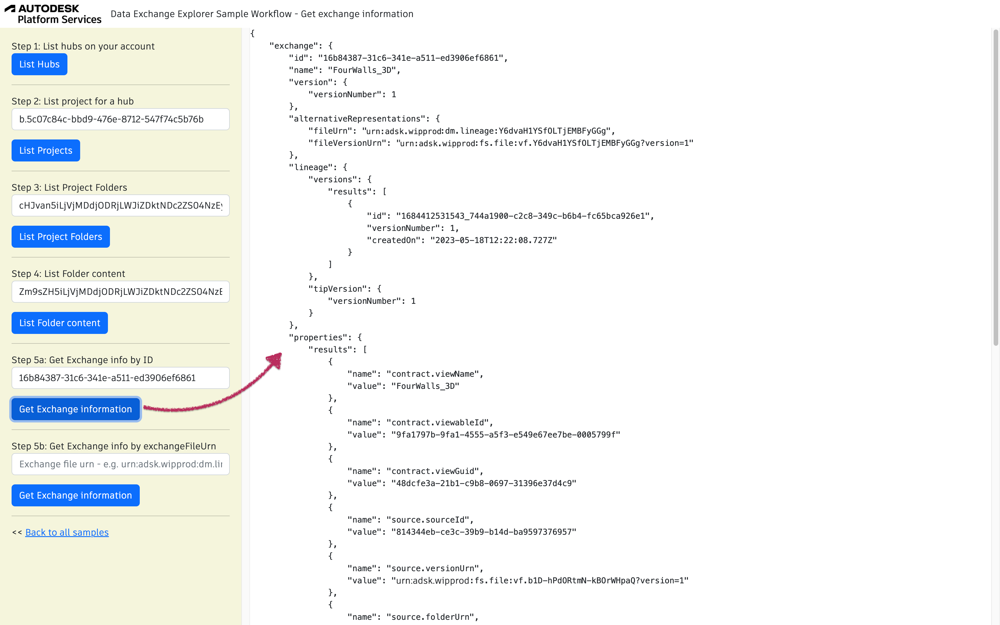

## Design Validation Sample Workflow

Before exploring the exchanged data, it is required to get the exchange id, which can be retrieved
from the exchange item located in ACC. <br/>
This workflow focuses on the part of the Data Exchange GraphQL API, needed to navigate through hubs, projects,
folders and identifying the exchange item.

To run the sample, please review [setup](./README.md#SETUP) instructions.

## Step 1: List all hubs

After login (top-right), click on `List Hubs` and take note of the hubId (`id`). [See NodeJs code](/services/aps/dx.js). 



Query used:

```
{
    hubs {
        results {
                name
                id
        }
    }
}
```

## Step 2: List all projects

Use the `HubId` from step 1 to list all projects and take note of the projectId (`id`). [See NodeJs code](https://github.com/autodesk-platform-services/aps-dx-samples-nodejs/blob/main/services/aps/dx.js). 



Query used:

```
{
    projects (hubId: "b.768ca****4e48") {
        results {
            name
            id
        }
    }
}
```

## Step 3: List Project Folders

This step uses `hubId` and `projectId`. Click on List Project Folders. [See NodeJs code](https://github.com/autodesk-platform-services/aps-dx-samples-nodejs/blob/main/services/aps/dx.js). 



Query used:

```
{
    project( hubId: "b.768ca****4e48" projectId: "b.d7617***5b7e97") {
            id
            name
            folders {
                results {
                    id
                    name
                    items {
                        results {
                            id
                            name
                            __typename
                            ... on BasicFile {
                                    name
                            }
                        }
                    }
                }
            }
    }
}
``` 

***Note:*** In this request we show not only the main folders like *Project Files* and *For the Field*, 
but also the sub-folders.


## Step 4: List Folder Content

This step uses `hubId`, `projectId` and the `folderId`. Click on List Folders Content. [See NodeJs code](https://github.com/autodesk-platform-services/aps-dx-samples-nodejs/blob/main/services/aps/dx.js).

***Note:*** In case there are sub-folders needed to be explored, 
put the sub-folder urn into same filed and rerun again this step  



Query used:

```
{
    items(
        hubId: "b.768ca****4e48" 
        projectId: "b.d7617***5b7e97"
        itemId: "urn:adsk.wipprod:fs.folder:co.ASTmHF***qzg"
      
    ) {
      results {
        id
        name
        extensionType
       }
     }
}
``` 

***Note:*** For the next step, we are interested in items of type `"items:autodesk.bim360:FDX"`.


## Step 5: Get Exchange information

This step uses only the `exchangeFileUrn` received from the previous results. Click on Get Exchange Information. [See NodeJs code](https://github.com/autodesk-platform-services/aps-dx-samples-nodejs/blob/main/services/aps/dx.js).



Query used:

```
{
    exchanges(filter: { exchangeFile: "urn:adsk.wipprod:dm.lineage:8nq***oQ" }) {
      results {
            id
            name
            versions{
                results{
                    id
                    createdOn
                }
            }
            
            
      }
    }
}
``` 

***Note:*** Once the id of the exchange is identified, all subsequent calls to explore the exchanged data through Data Exchange GraphQL, will require the above exchange id.