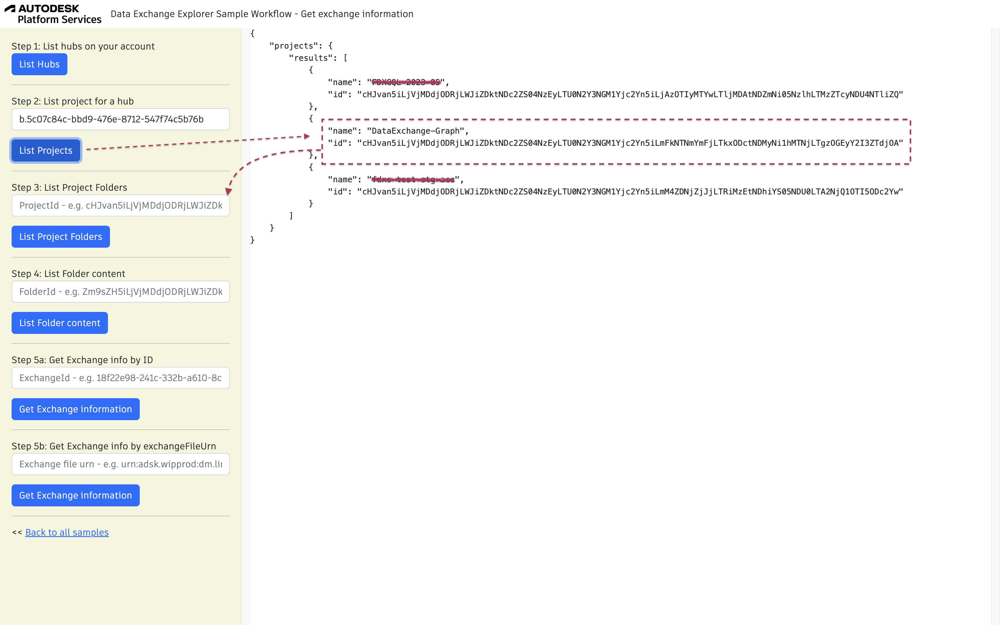
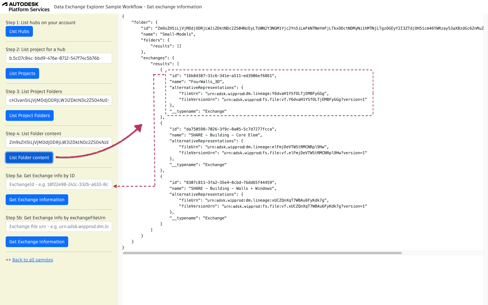

## Retrieving the Exchange Item info

Before exploring the exchanged data, it is required to get the exchange id, which can be retrieved
from the exchange item located in ACC. <br/>
This code sample focuses on the part of the Data Exchange GraphQL API, needed to navigate through hubs, projects,
folders and identifying the exchange item.

To run the sample, please review [setup](./README.md#SETUP) instructions.

## Step 1: List all hubs

After login (top-right), click on `List Hubs` and take note of the hubId (`id`). [See NodeJs code](/services/aps/dx.js). 


Query used:

```
{
    hubs {
        results {
                name
                id
        }
    }
}
```

## Step 2: List all projects

Use the `HubId` from step 1 to list all projects and take note of the projectId (`id`). [See NodeJs code](/services/aps/dx.js).



Query used:

```
{
    projects (hubId: "b.768ca****4e48") {
        results {
            name
            id
        }
    }
}
```

## Step 3: List Project Folders

This step uses `projectId`. Click on List Project Folders. [See NodeJs code](/services/aps/dx.js).


Query used:

```
    {
      project(projectId: "${projectId}") {
        id
        name
        folders {
          results {
            id
            name
            __typename
    
            folders {
                results {
                    id
                    name
                    __typename
                }
            }
            exchanges {
                results {
                    id
                    name
                    __typename
                }
            }
          }
        }
      }
    }
```

***Note:*** In this request response contains the folders and exchanges within a project.


## Step 4: List Folder Content

This step uses `folderId`. Click on List Folders Content. [See NodeJs code](/services/aps/dx.js).

***Note:*** This query returns the folders and exchanges within the folder.



Query used:

```
    {
      folder(folderId: "${folderId}") {
        id
        name
        folders {
          results {
            id
            name
            __typename
          }
        }
        exchanges {
          results {
            id
            name
            alternativeRepresentations {
              fileUrn
              fileVersionUrn
            }
            __typename
          }
        }
      }
    }
``` 

## Step 5a: Get Exchange information

This step uses only the `exchangeId` received from the previous results. Click on Get Exchange Information. [See NodeJs code](/services/aps/dx.js).


Query used:

```
  {
    exchange(exchangeId: "${exchangeId}") {
      id
      name
      version {
        versionNumber
      }
      alternativeRepresentations {
        fileUrn
        fileVersionUrn
      }
      lineage {
        versions {
          results {
            id
            versionNumber
            createdOn
          }
        }
        tipVersion {
          versionNumber
        }
      }
      properties {
        results {
          name
          value
        }
      }
    }
  }
``` 

## Step 5b: Get Exchange information by exchangeFileUrn
Exchange Information can also be retrived by using `exchangeByFile` query.


```
    {
      exchangeByFileId(exchangeFileId: "${exchangeFileUrn}") {
        id
        name
        version {
          versionNumber
        }
        lineage {
          versions {
            results {
              id
              versionNumber
              createdOn
            }
          }
          tipVersion {
            versionNumber
          }
        }
        properties {
          results {
            name
            value
          }
        }
      }
    }
```

> **Note**: Once exchangeId is retrived from above steps, we will use this exchangeId for the further process.