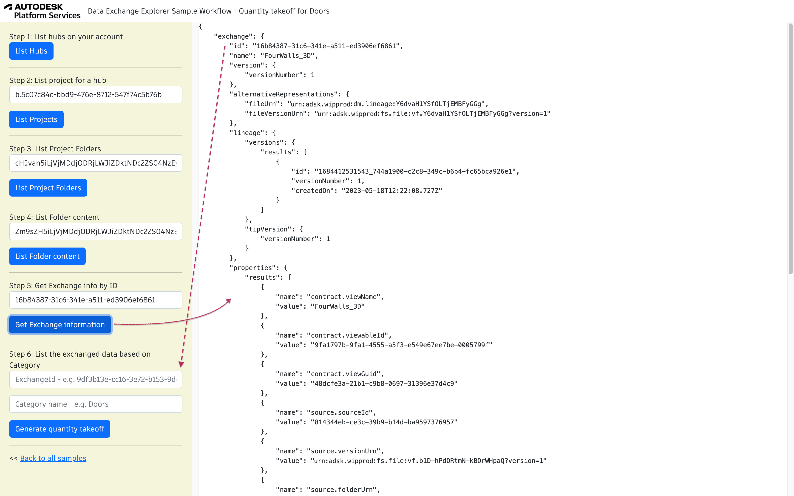
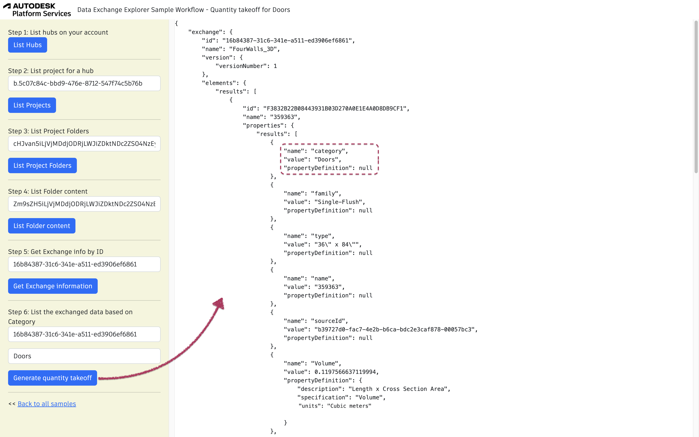

## Quantity takeoff for Doors Sample Workflow

Let's take the sample model and imagine that you would like to build a quantity takeoff for 'Doors'. 
You will need to get all design entities filtered by classification 'Doors'. 

To run the sample, please review [setup](./README.md#SETUP) instructions.

## Step 1: List all hubs

After login (top-right), click on `List Hubs` and take note of the hubId (`id`). [See NodeJs code](/services/aps/dx.js).


## Step 2: List all projects

Use the `HubId` from step 1 to list all projects and take note of the projectId (`id`). [See NodeJs code](/services/aps/dx.js).


## Step 3: List Project Folders

This step uses `hubId` and `projectId`. Click on List Project Folders. [See NodeJs code](/services/aps/dx.js).


***Note:*** In this request we show not only the main folders like *Project Files* and *For the Field*,
but also the sub-folders.


## Step 4: List Folder Content

This step uses `hubId`, `projectId` and the `folderId`. Click on List Folders Content. [See NodeJs code](/services/aps/dx.js).

***Note:*** In case there are sub-folders needed to be explored,
put the sub-folder urn into same filed and rerun again this step


***Note:*** For the next step, we are interested in items of type `"items:autodesk.bim360:FDX"`.


## Step 5: Get Exchange information

This step uses only the `exchangeFileUrn` received from the previous results. Click on Get Exchange Information. [See NodeJs code](/services/aps/dx.js).




## Step 6: Generate quantity takeoff

Use the `exchangeId` from step 5. Click on generate quantity takeoff. You may adjust the `Category` field. [See NodeJs code](/services/aps/dx.js). 



GraphQL query used:

```
{
    designEntities(
            filter: {
                exchangeId: "${exchangeId}", 
                classificationFilter: {category: "${category}"}}
            ) {
               results {
                 id
                 name
                 classification {
                   category
                 }
                  properties{
                    results {
                        name
                        displayValue
                        value
                    propertyDefinition {
                       description
                       specification
                       type
                       units
                    }
                  }
               }
           }
    }
}
```