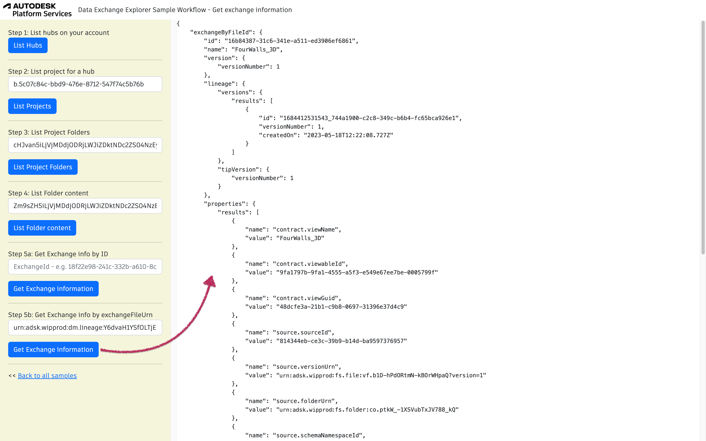

# Data Exchange Samples in NodeJs

## Description

The following samples showcase some fundamental GraphQL queries for Data Exchange, which are used to implement the following workflows:

- [Retrieving the Exchange Item info](./ExchangeItemInfo.md)
- [Quantity takeoff for Doors Sample Workflow](./QuantityTakeOff.md)
- [Window Schedule Sample Workflow](./Schedule.md)

## Setup

### Prerequisites

- [APS credentials](https://forge.autodesk.com/en/docs/oauth/v2/tutorials/create-app) (use `http://localhost:8080/api/auth/callback` as callback URL, take note of you Client ID and Client Secret)
- Provisioned access to [ACC Account](https://forge.autodesk.com/en/docs/bim360/v1/tutorials/getting-started/manage-access-to-docs/) (use Client Id from above)
- [Node.js](https://nodejs.org) (we recommend the Long Term Support version)
- Terminal (for example, [Windows Command Prompt](https://en.wikipedia.org/wiki/Cmd.exe)
or [macOS Terminal](https://support.apple.com/guide/terminal/welcome/mac))

### Running locally

Clone this project or download it. It's recommended to install GitHub desktop. 
To clone it via command line, use the following (Terminal on MacOSX/Linux, Git Shell on Windows):

    git clone https://github.com/autodesk-platform-services/aps-dx-samples-nodejs.git

Specify the following environment variables:

Mac OSX/Linux (Terminal)

    npm install
    export APS_CLIENT_ID=<<YOUR CLIENT ID FROM DEVELOPER PORTAL>>
    export APS_CLIENT_SECRET=<<YOUR CLIENT SECRET>>
    export APS_CALLBACK_URL=http://localhost:8080/api/auth/callback
    npm start

Windows

    npm install
    set APS_CLIENT_ID =<<YOUR CLIENT ID FROM DEVELOPER PORTAL>>
    set APS_CLIENT_SECRET =<<YOUR CLIENT SECRET>>
    set APS_CALLBACK_URL=http://localhost:8080/api/auth/callback
    npm start

## Troubleshooting

General [APS Support form](https://forge.autodesk.com/en/support/get-help).

## License

This sample is licensed under the terms of the [MIT License](http://opensource.org/licenses/MIT).
Please see the [LICENSE](LICENSE) file for more details.

## Written by

- Denis Grigor, Developer Advocate
- Suraj Kumar, Software Developer 
