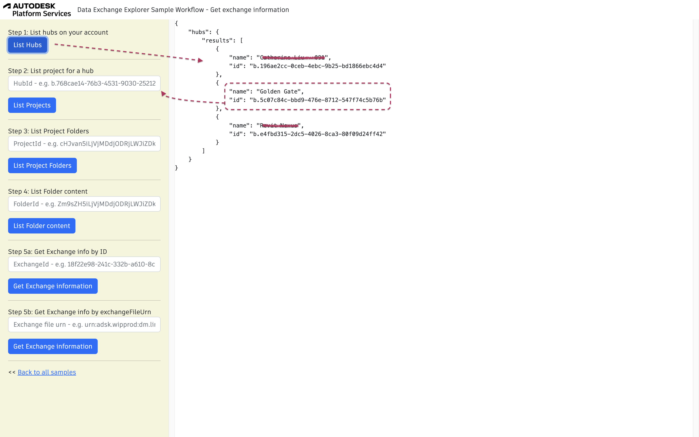

## Window Schedule Sample Workflow

A schedule is typically used to identify, in most cases a chart or table providing descriptions of the windows , doors, finishes, lintels, footings, piers, etc. on a construction project. Let's take the same sample model and imagine that you would like to build a window schedule. You will need to retrieve properties like panel glazing, glass, frame material, height, width, etc. of all design entity instances of category windows.

To run the sample, please review [setup](./README.md#SETUP) instructions.

## Step 1: List all hubs

After login (top-right), click on `List Hubs` and take note of the hubId (`id`). [See NodeJs code](/services/aps/dx.js).



## Step 2: List all projects

Use the `HubId` from step 1 to list all projects and take note of the projectId (`id`). [See NodeJs code](/services/aps/dx.js).


## Step 3: List Project Folders

This step uses `projectId`. Click on List Project Folders. [See NodeJs code](/services/aps/dx.js).


## Step 4: List Folder Content

This step uses `folderId`. Click on List Folders Content. [See NodeJs code](/services/aps/dx.js).


***Note:*** For the next step, we are interested only in exchangeId.


## Step 5: Get Exchange information

This step uses only the `exchangeId` from the previous step. Click on Get Exchange Information. [See NodeJs code](/services/aps/dx.js).


## Step 6: Generate quantity takeoff

Use the `exchangeId`. Click on generate schedule. You may adjust the `Category` field wrapped under single quote. [See NodeJs code](/services/aps/dx.js) 


Query used:

```
{
      exchange(exchangeId: "${exchangeId}") {
        id
        name
        version {
          versionNumber
        }
        elements(filter: {query: "property.name.category=='${category}'"}) {
          results {
            id
            name
            properties(filter: {names: ["Volume", "category"]}) {
              results {
                name
                value
                propertyDefinition {
                  description
                  specification
                  id
                  units
                  valueType
                }
              }
            }
          }
        }
      }
    }
```
***Note:*** In property filter, it takes a list of filter that are only in the response.
